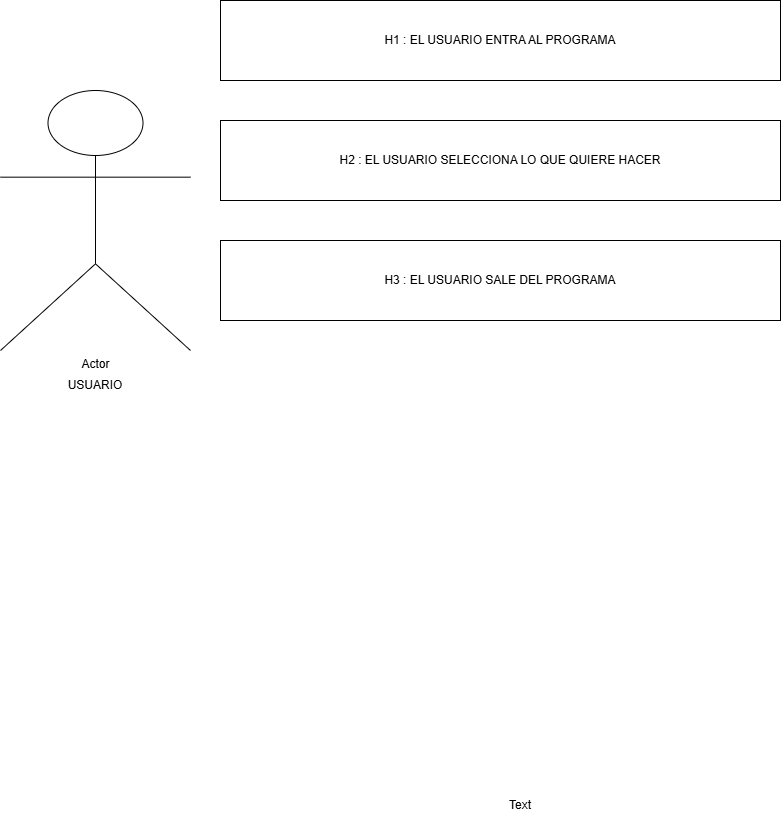

# POO
Objetivo : El objetivo de este programa es reforzar el aprendizaje de los principios de la Programación Orientada a Objetos (POO) mediante una aplicación interactiva en Python que permite mostrar las principales propiedades de la POO (encapsulamiento, herencia, polimorfismo y abstracción) y evaluar el conocimiento del usuario a través de un cuestionario de opción múltiple, aplicando el uso de clases, métodos, atributos y estructuras de control, fomentando así la comprensión práctica de estos conceptos fundamentales.

### ¿Para qué te sirve este programa como universitaria?

Este programa te sirve para comprender y aplicar de manera práctica la Programación Orientada a Objetos, ya que no solo ves la teoría, sino que la usas en un sistema real. En específico, te ayuda a:

1 Entender mejor los conceptos de POO  
    Al mostrar y evaluar encapsulamiento, herencia, polimorfismo y abstracción, refuerzas lo que ves en clase de forma práctica.

    
2 Practicar el uso de clases y objetos en Python  
    Aprendes a crear clases, constructores, métodos y atributos, que es la base para materias más avanzadas.
    
3 Desarrollar lógica de programación  
    Usas estructuras como listas, diccionarios, ciclos `for`, condicionales `if-elif-else` y validación de entradas.

    